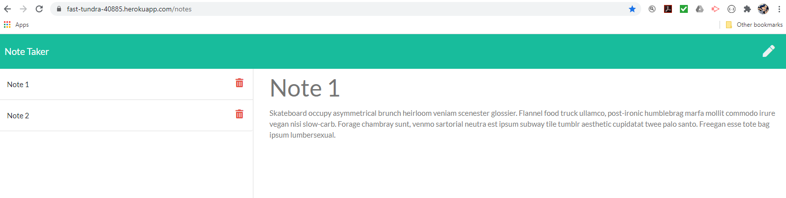

# Notable 

## Description

This is a simple notepad app designed to save notes in a browser. Notes can also be easily deleted. <https://fast-tundra-40885.herokuapp.com/>

## Table of Contents

- [Installation](#installation)
- [Usage](#usage)
- [License](#license)
- [Contributing](#contributing)
- [Questions](#questions)
- [Credits](#credits)

## Installation

If you'd like your very own note taker, please clone my repo. Make sure you have node.js installed on your computer. You can find the download here <https://nodejs.org/en/download/>. Run npm install to install all dependencies. Run node server.js in the command line and open <http://localhost:8080> in a browser window. You can also try it out using my version on Heroku. <https://fast-tundra-40885.herokuapp.com/>

## Usage

Use this app to save notes for later reference. Type in a note title and text then click the save icon. Use the delete icon next to a note when you no longer need it.

## License

GNU General Public License v3.0

The GNU License allows the software to be modified and distributed by other users. It does not impose any restrictions on the use of the software but requires that it remain open source.

## Contributing

Please contribute to this project if you feel that you can make the code more efficient or if you'd like to add more questions for the user. Create your own branch from the Master and submit a pull request. I ask that you follow the Contributor Covenant code of conduct: <https://www.contributor-covenant.org/version/2/0/code_of_conduct/code_of_conduct.md> 

## Questions

- [Github Profile](https://github.com/melindawinter)
- melindawinter42@gmail.com
- Please email me or connect with me on Linked In: <http://www.linkedin.com/in/melinda-winter-34a25689>.

## Credits

Thank you to my team member Cyrus Jose and boot camp TA Adam Abundis for being in touch and supportive via Slack. Thanks to Thor Nolan, for helping me get started and finally make it all work.
